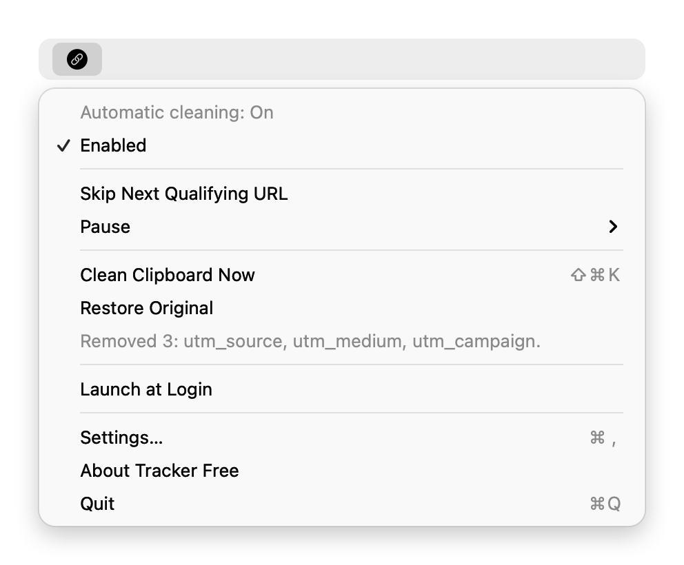
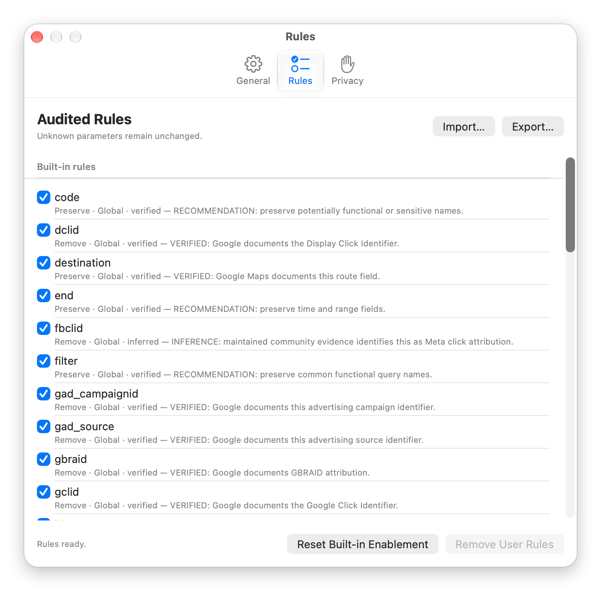
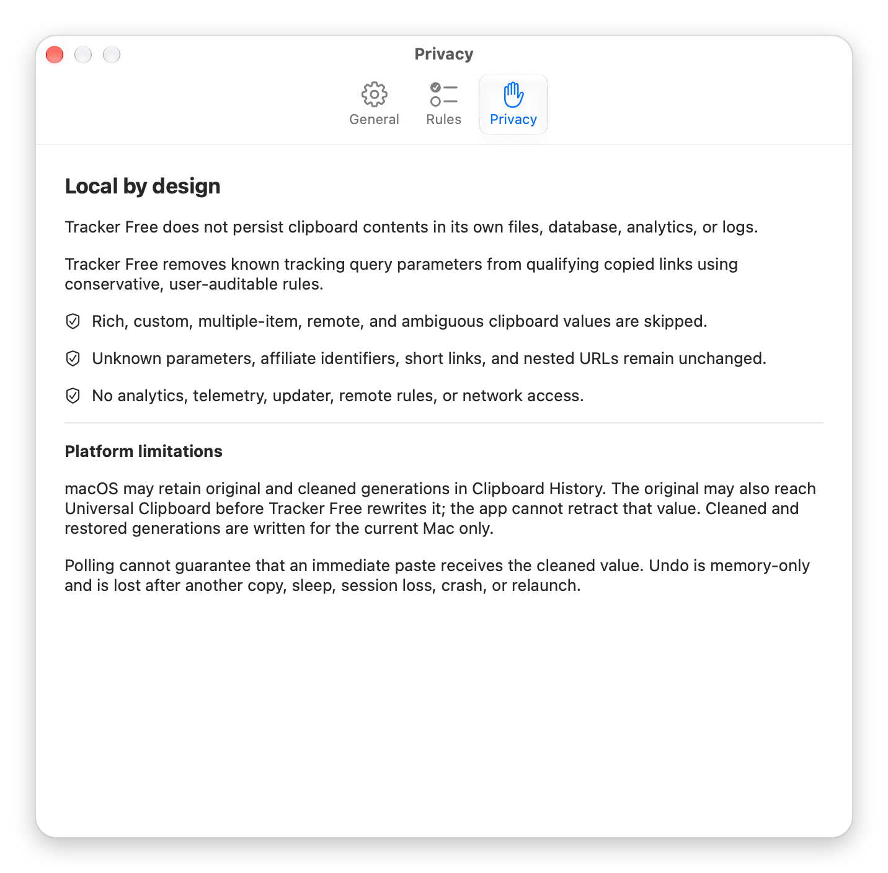

# Tracker Free

**A small macOS menu-bar app that removes tracking junk from links you copy. It leaves anything it isn't sure about alone.**

Copy a link like this:

```text
https://example.com/article?id=42&utm_source=newsletter&utm_medium=email&utm_campaign=fall
```

and what you paste is:

```text
https://example.com/article?id=42
```

Tracker Free runs quietly in the menu bar. When you copy a single, plain link, it removes known tracking parameters such as `utm_*`, `gclid`, and `fbclid`, and keeps everything else exactly as it was, down to each byte. It does nothing with prose, code, rich text, short links, signed links, or login links. It has no network access, keeps nothing on disk, and every rule it applies can be reviewed in Settings.





## What it removes

Tracker Free removes a parameter only when a rule names it exactly. There are 52 built-in rules, and each one records its scope, a confidence level, and where the evidence for it came from.

**Global tracking parameters** (removed from any qualifying link):

| Family | Parameters |
|---|---|
| Google Analytics campaigns | `utm_id`, `utm_source`, `utm_medium`, `utm_campaign`, `utm_source_platform`, `utm_term`, `utm_content`, `utm_creative_format`, `utm_marketing_tactic` |
| Google Ads | `gclid`, `dclid`, `gbraid`, `wbraid`, `gad_source`, `gad_campaignid` |
| Microsoft Ads, TikTok, Mailchimp, Meta | `msclkid`, `ttclid`, `mc_cid`, `mc_eid`, `fbclid` |

A catch-all `utm_` prefix rule exists but is **off by default**, because it is experimental.

**Host-scoped share parameters.** These are removed only on the named sites and only on specific kinds of pages:

| Site | Parameter | Example |
|---|---|---|
| X / Twitter status permalinks | `s`, `t` | `https://x.com/user/status/123?s=20&t=abc` → `https://x.com/user/status/123` |
| YouTube video routes | `si` | `https://youtu.be/abc?si=tok&t=90` → `https://youtu.be/abc?t=90` (the timestamp stays) |
| Instagram content routes | `igsh`, `igshid` | `https://www.instagram.com/reel/ABC/?igsh=FAKE` → `https://www.instagram.com/reel/ABC/` |

Host matching is exact. `https://x.com.evil/user/status/123?s=20&t=abc` is left unchanged, and so is a YouTube search page with `si`.

**Functional parameters are always kept.** Built-in preserve rules protect names like `q`, `v`, `id`, `page`, `sort`, `filter`, `variant`, `list`, `index`, `start`, `end`, `origin`, `destination`, and Amazon affiliate `tag`. Any parameter that no rule mentions is kept as well.

## What it never touches

The guiding rule is simple: **when in doubt, leave the clipboard unchanged.**

- **Shorteners and redirect wrappers.** `bit.ly`, `t.co` and similar short links, plus Facebook and Google redirect wrappers, stay as they are. Tracker Free never follows a link, resolves a redirect, or expands a short URL.
- **Signed, OAuth, and token links.** AWS S3 and CloudFront signatures, Google Cloud Storage, Azure SAS, password-reset links, OAuth callbacks and authorization requests, and token fragments are left exactly as copied, even when they also carry `utm_source`. Removing anything from a signed URL would break it.
- **Local and unusual hosts.** `localhost`, private and IP-literal addresses, userinfo (`user@host`), non-HTTP schemes, scheme-relative links, and literal-Unicode URLs are skipped.
- **Anything that isn't exactly one link.** Prose, Markdown, code, shell commands, text with several URLs, rich text, images, files, custom pasteboard types, multiple items, and content arriving from another device are skipped.
- **Anything ambiguous.** Malformed percent-encoding, `;`-separated queries, rule conflicts, oversize input (more than 64 KiB), or a clipboard that changes during processing all mean no write happens.

When it does clean a link, only whole `name=value` fields are removed. It never re-encodes anything. The order of the remaining fields, `+` signs, `%2f` versus `%2F`, empty fields, the fragment, and any whitespace around the link are all kept exactly.

## Privacy

- **No network.** The app is sandboxed and has no network client or server entitlement. It contains no `URLSession`, WebKit, DNS, link previews, analytics, telemetry, crash reporting, or updater. Static scans in the test suite reject network APIs.
- **RAM only.** The original link, the cleaned link, and the one-step undo exist only in memory. They are wiped on sleep, logout, session loss, and quit. Nothing clipboard-derived is written to disk, preferences, or logs.
- **Minimal entitlements.** The entitlements are App Sandbox, Hardened Runtime, and user-selected file read/write, which is used only to import and export rules. It does not ask for Accessibility, Input Monitoring, Automation, or Screen Recording access.
- **Platform limits, stated honestly.** macOS may still keep the original in Clipboard History, and the original can reach Universal Clipboard before it is cleaned. Tracker Free writes cleaned values to the current Mac only. See [Privacy](docs/PRIVACY.md).



## Features

- Automatic cleaning of newly copied links, based on pasteboard change counts.
- **Clean Clipboard Now** (⇧⌘K) and a **Clean Current Clipboard** App Intent for Shortcuts.
- **Skip Next**, pause for 5 or 30 minutes or until resumed, and a memory-only **Restore Original**.
- An audited rule list in Settings. You can switch built-in rules on and off, and import or export your own typed rules. Rules cannot contain regex or scripts, and imports are checked against size and conflict limits.
- Launch at Login through `SMAppService`.

> **Status.** The cleaning engine, rules, and clipboard coordinator are complete and pass the automated suites described below. The following have not yet been confirmed on an installed build and are tracked as open in [Current status](docs/STATUS.md): real system clipboard-permission prompts, Launch at Login, App Intent execution through Shortcuts, long-run energy use, and cross-app manual QA.

## Install

1. Download `TrackerFree-1.0.0-macOS.zip` from [Releases](https://github.com/vdoshi96/tracker-free/releases) and unzip it.
2. Move **Tracker Free.app** to `/Applications`.
3. The app is **ad-hoc signed and not notarized**, so Gatekeeper blocks it the first time you open it:
   - **macOS 13–14:** right-click the app, choose **Open**, then choose **Open** again.
   - **macOS 15 and later:** open it once, then go to **System Settings → Privacy & Security** and click **Open Anyway**.
4. Look for the link icon in the menu bar. The first time automatic cleaning runs, macOS may ask whether Tracker Free can read the clipboard. Background cleaning needs **Always Allow**.

Requires macOS 13 or later. The release build is Apple silicon (arm64).

## Build from source

Requires Xcode with the macOS SDK. The project and scheme are both `TrackerFree`.

```sh
git clone https://github.com/vdoshi96/tracker-free.git
cd tracker-free

# Release build (ad-hoc signed)
xcodebuild -project TrackerFree.xcodeproj -scheme TrackerFree -configuration Release build

# Unit, property, and coordinator tests
xcodebuild -project TrackerFree.xcodeproj -scheme TrackerFree -configuration Debug \
  -destination 'platform=macOS' CODE_SIGNING_ALLOWED=NO test -only-testing:TrackerFreeTests

# Release acceptance: all 74 fixtures plus performance budgets
xcodebuild -project TrackerFree.xcodeproj -scheme TrackerFree -configuration Release \
  -destination 'platform=macOS' CODE_SIGNING_ALLOWED=NO ENABLE_TESTABILITY=YES \
  test -only-testing:TrackerFreeTests/AcceptanceTests
```

`ENABLE_TESTABILITY=YES` is passed only to the acceptance run. The shipping Release configuration keeps it off. [Testing](docs/TESTING.md) has the full command list.

## Testing highlights

- **74 numbered acceptance fixtures** cover global removals, duplicates, empty fields, `+` and exact `%HH` retention, case sensitivity, X/YouTube/Instagram/TikTok/Reddit/Amazon behavior, Maps and calendar links, AWS/GCS/CloudFront/Azure signatures, OAuth and reset links, redirect wrappers, shorteners, localhost and IP hosts, Punycode, whitespace envelopes, prose and code, and exact 64 KiB boundaries.
- **Property checks:** `clean(clean(x)) == clean(x)`; output never grows; kept fields form an exact ordered subsequence; the scheme, host, path, and fragment stay byte-identical; rule order cannot change precedence; host fuzzing covers case, suffix attacks, ports, Punycode, and IPv4/IPv6.
- **Failure injection** covers clipboard races, write and readback failures, ownership loss during rollback, stale undo, competing clipboard cleaners, sleep/wake, session loss, and relaunch. Tests use fake or uniquely named pasteboards, never your real clipboard.
- **Performance** (Release, 21-sample medians on exactly 64 KiB inputs): a large query value in **9.09 ms**, many query fields in 1.99 ms, many path components in 0.61 ms, and a long parameter name against 512 rules in 5.48 ms. 10,000 synthetic clipboard events retained **48 KiB** of memory, against a 5 MiB budget.
- The latest recorded Debug run had 78 of 79 top-level tests passing, with one Release-only performance test skipped by design. Release acceptance passed 4 of 4.

## Built with AI

I built Tracker Free with AI coding agents. The agents worked within a written specification and had to back every claim with evidence. The repository keeps that process visible:

1. **Spec first.** [Project](docs/PROJECT.md) sets the scope, the exclusions, and a definition of done. [Architecture](docs/ARCHITECTURE.md) and [Rules](docs/RULES.md) set the safety invariants and rule precedence before any code was written.
2. **Failure matrix.** [Failure matrix](docs/FAILURE_MATRIX.md) lists 34 ways a clipboard tool can hurt you, such as a corrupted clipboard, a broken signed URL, a stale undo, or a leak into logs. Each row names the design that prevents it and the test that proves it. Every release-blocking row needs a passing deterministic test.
3. **Tests as the contract.** The failure matrix became the 74 fixtures, the property checks, and the race and failure-injection tests. The code was written to pass them.
4. **Claims are labeled.** Internal docs mark each statement as *verified* (observed), *recommendation*, or *open*. [Current status](docs/STATUS.md) is the single source of truth, and [Project log](docs/LOG.md) is append-only history. Rule provenance is recorded in [Sources](docs/SOURCES.md).

## Documentation

[Current status](docs/STATUS.md) · [Project](docs/PROJECT.md) · [Architecture](docs/ARCHITECTURE.md) · [Rules](docs/RULES.md) · [Privacy](docs/PRIVACY.md) · [Testing](docs/TESTING.md) · [Failure matrix](docs/FAILURE_MATRIX.md) · [Decisions](docs/DECISIONS.md) · [Sources](docs/SOURCES.md) · [Skills and workflows](docs/SKILLS.md) · [Project log](docs/LOG.md) · [Wiki index](docs/wiki.md) · [Repository instructions](AGENTS.md)

Markdown is canonical, and every document has a generated HTML companion. After editing Markdown, run:

```sh
xcrun swift Scripts/DocsParity.swift --generate
xcrun swift Scripts/DocsParity.swift --check
xcrun swift Scripts/DocsParityIntegrationTests.swift
```
